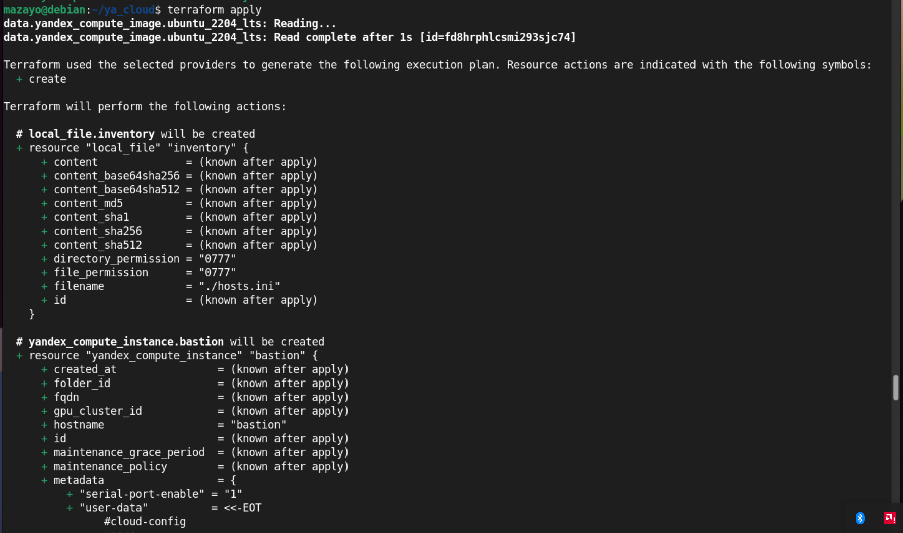
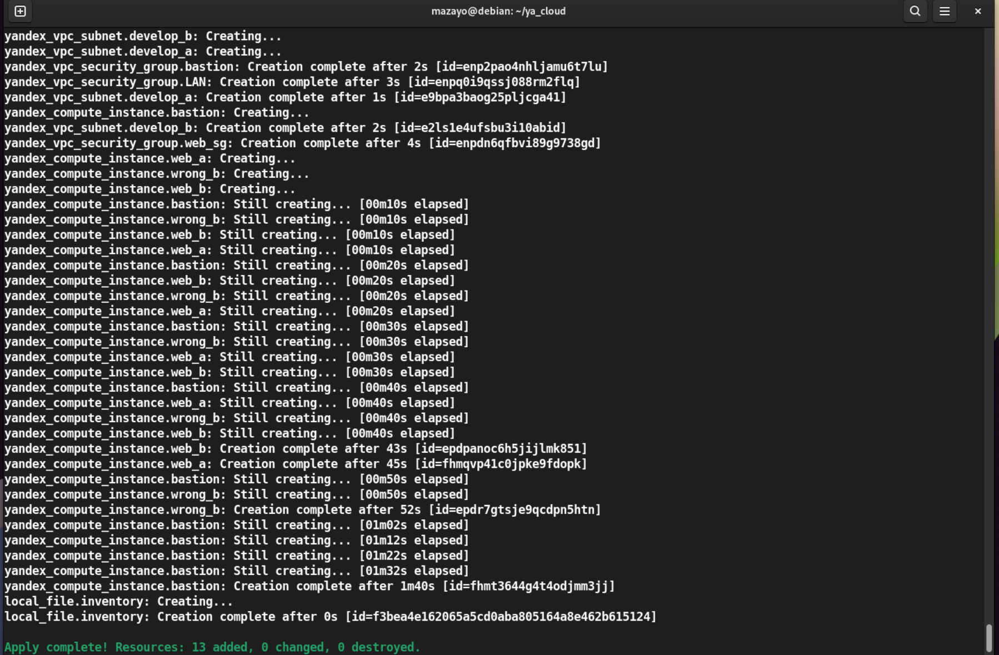
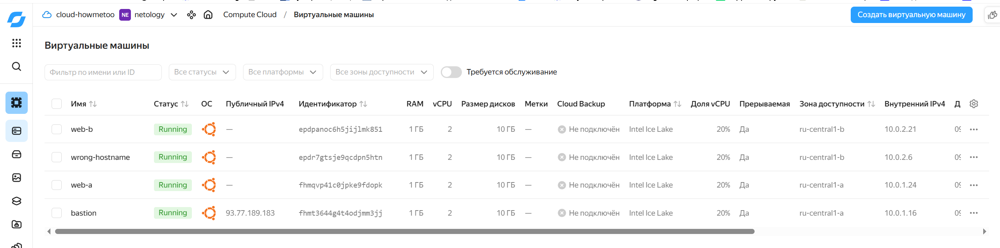
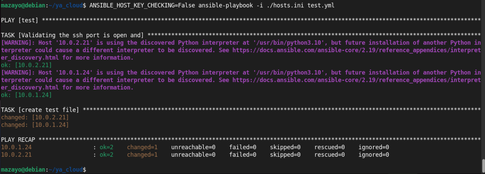
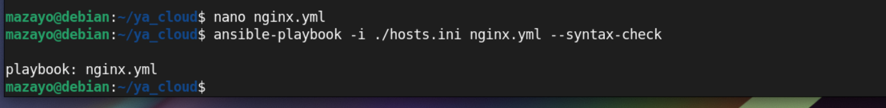
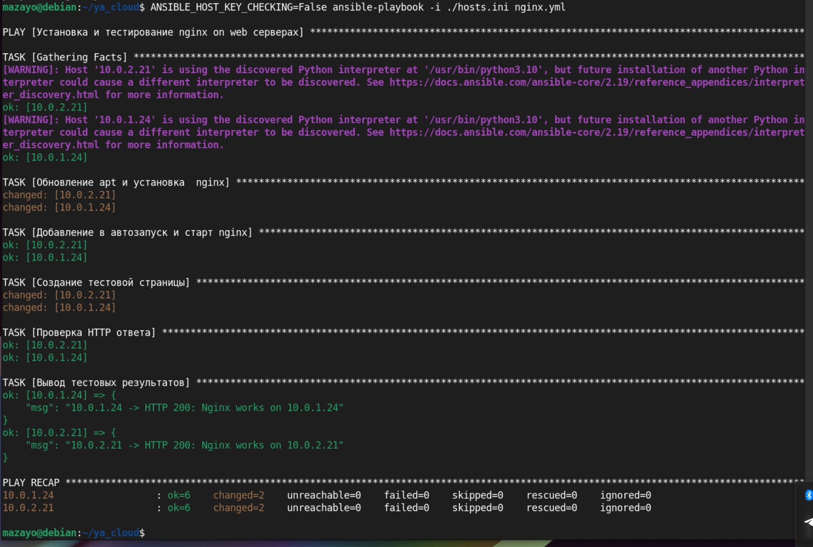

# Домашнее задание к занятию "`Подъем инфраструктуры в облаке`" - `Насибуллин Михаил`


### Инструкция по выполнению домашнего задания

   1. Сделайте `fork` данного репозитория к себе в Github и переименуйте его по названию или номеру занятия, например, https://github.com/имя-вашего-репозитория/git-hw или  https://github.com/имя-вашего-репозитория/7-1-ansible-hw).
   2. Выполните клонирование данного репозитория к себе на ПК с помощью команды `git clone`.
   3. Выполните домашнее задание и заполните у себя локально этот файл README.md:
      - впишите вверху название занятия и вашу фамилию и имя
      - в каждом задании добавьте решение в требуемом виде (текст/код/скриншоты/ссылка)
      - для корректного добавления скриншотов воспользуйтесь [инструкцией "Как вставить скриншот в шаблон с решением](https://github.com/netology-code/sys-pattern-homework/blob/main/screen-instruction.md)
      - при оформлении используйте возможности языка разметки md (коротко об этом можно посмотреть в [инструкции  по MarkDown](https://github.com/netology-code/sys-pattern-homework/blob/main/md-instruction.md))
   4. После завершения работы над домашним заданием сделайте коммит (`git commit -m "comment"`) и отправьте его на Github (`git push origin`);
   5. В личном кабинете прикрепите и отправьте ссылку на решение в виде md-файла в вашем Github.
   6. Любые вопросы по выполнению заданий спрашивайте в разделе “Вопросы по заданию” в личном кабинете.
   
Желаем успехов в выполнении домашнего задания!
   
### Дополнительные материалы, которые могут быть полезны для выполнения задания

1. [Руководство по оформлению Markdown файлов](https://gist.github.com/Jekins/2bf2d0638163f1294637#Code)

---

### Задание 1
### Повторить демонстрацию лекции (развернуть vpc, 2 веб сервера, бастион сервер).










---

### Задание 2
### 1. С помощью ansible подключиться к web-a и web-b , установить на них nginx.(написать нужный ansible playbook)
### 2. Провести тестирование и приложить скриншоты развернутых в облаке ВМ, успешно отработавшего ansible playbook.


```
---
- name: Установка и тестирование nginx on web серверах
  hosts: webservers
  remote_user: user
  become: true

  tasks:
    - name: Обновление apt и установка  nginx
      ansible.builtin.apt:
        name: nginx
        state: present
        update_cache: true
        cache_valid_time: 3600

    - name: Добавление в автозапуск и старт nginx
      ansible.builtin.service:
        name: nginx
        state: started
        enabled: true

    - name: Создание тестовой страницы
      ansible.builtin.copy:
        dest: /var/www/html/index.html
        owner: root
        group: root
        mode: "0644"
        content: |
          Nginx works on {{ inventory_hostname }}

    - name: Проверка HTTP ответа
      ansible.builtin.uri:
        url: http://127.0.0.1/
        status_code: 200
        return_content: true
      register: nginx_check

    - name: Вывод тестовых результатов
      ansible.builtin.debug:
        msg: "{{ inventory_hostname }} -> HTTP {{ nginx_check.status }}: {{ nginx_check.content | trim }}"
```
---





